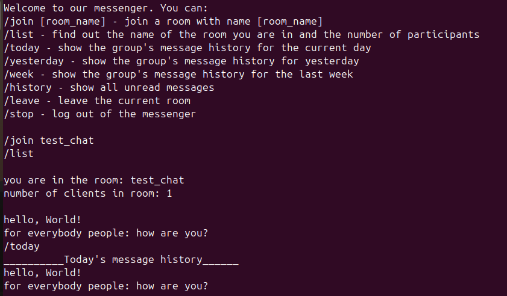
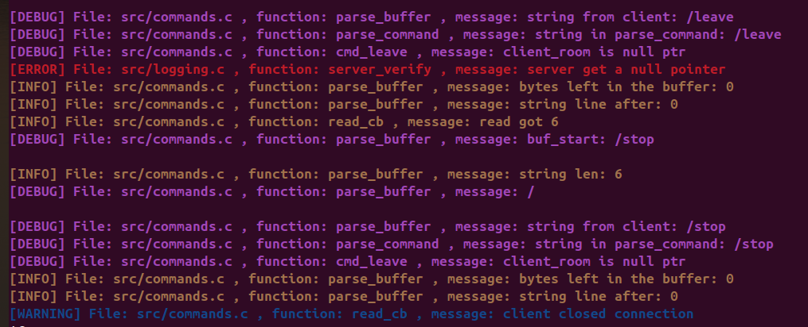
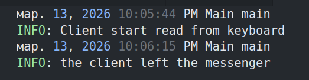

# Messenger 📱

**Асинхронный консольный мессенджер** с поддержкой комнат, персистентностью истории и цветным логированием.

Сервер и клиент написаны на чистом C с использованием **libuv** для неблокирующего ввода-вывода.

## **Функционал на данный момент времени** 👾

Рабочая библиотека: ```libuv```

Сейчас в папке проекта находятся две рабочие подпапки: Server и Client.

```Server```: отвечает за запуск сервера, принятие сообщений от адресантов и передачу их адресатам.

```Client```: отвечает за взаимодействие клиента с сервером( чтение сообщений с консоли и от сервера ).


Также при каждом запуске создается каталог ```Database```, который содержит историю сообщений каждой комнаты в виде текстовых файлов.

Структура проекта:
```
├──📂 Server
|  ├──📂include
|  |  ├──📄commands.h
|  |  ├──📄logging.h
|  |  ├──📄string_function.h
|  |  ├──📄database.h
|  ├──📂src
|  |  ├──📄commands.c
|  |  ├──📄logging.c
|  |  ├──📄string_function.c
|  |  ├──📄database.c
|  |  ├──📄server.c
├──📂 Client
|  ├──📂include
|  |  ├──📄callbacks.h
|  |  ├──📄logger.h
|  ├──📂src
|  |  ├──📄client.c
|  |  ├──📄callbacks.c
|  |  ├──📄logger.c
```

Сетевое взаимодействие происходит по схеме:
```
 ________________________________________
|                                        |
|    АДРЕСАНТ -> СЕРВЕР -> АДРЕСАТ       |
|________________________________________|

```
>⚠️ На данный момент времени всё общение между пользователями происходит в консоли
>

Команды, которые может вызвать клиент и которые осуществляет сервер

|   Команда                         |   Действие                                                                                       |
|:---------------------------------:|:------------------------------------------------------------------------------------------------:|
|           /week                   |      Показать историю сообщений в комнате за последнюю неделю                                    |
|           /join                   |      После этой команды клиент указывает имя комнаты( чата ), к которой хочет присоединиться     |
|           /list                   |      Отправляет клиенту имя комнаты, в которой он находится, и количество участников в комнате   |
|           /stop                   |      Прекратить работу в мессенджере( завершить программу )                                      |
|           /leave                  |      Покинуть текущую комнату                                                                    |
|           /today                  |      Показать историю сообщений в комнате за сегодняшний день                                    |
|           /yesterday              |      Показать историю сообщений в комнате за вчерашний день                                      |
|           /history                |      Показать все непрочитанные сообщения                                                        |


>⚠️ Если первое слово пользователя не начинается с '/', то введенный текст считается сообщением
>

## **Персистентность чатов** 📦

### Формат хранения истории сообщений

При запуске сервера в корневой папке ```Project_messenger``` создается каталог ```database```


```database``` - это список всех комнат с их историями сообщений. Например, при создании комнаты с именем ```chat```
в папке создастся файл ```chat.txt```. Каждое сообщение в файле хранится в следующем формате:

```c
day message [hash]
```

```
day - день, в который было отправлено сообщение ( целое число 0 - 365 )
message - сообщение от клиента ( строка )
hash - уникально целое число, которое сопоставляется каждому сообщению в истории
```

Пример:
```c
65 hello [210714636441]
65 world [210732791149]
65 how are you? [15227816740892963271]
...
```

### Хеширование 🔐

Правило сопоставления каждой строке уникального числа реализуется с помощью алгоритма ```DJB2```

```c
unsigned long hash( const char* string ){
    assert( string );

    unsigned long hash = 5381;
    int c;
    while( ( c = *string++ ) ){
        hash = ( (hash << 5 ) + hash ) + c;
    }
    return hash;
}
```

### Краткое пояснение некоторых функций для работы с историей сообщений 📝

```c
/*
*сохраняет сообщение клиента, которое он хотел отправить, в историю комнаты
*/
database_err save_message( const char* message, FILE* message_history);


/*
*Возвращаемое значение: история сообщений
*В зависимости от параметра what_message вызывается соответствующая функция

-- история за сегодня/вчера/неделю назад
-- непрочитанные сообщения
-- вся история комнаты

*После чтения переиещаемся в начало файла
*/
char* get_history( FILE* message_history, search_history_t search_history, period_type what_message );


/*
*Проходимся по всему файлу от начала до текущего сообщения.
*Считываем первое число каждой строки - день, в который данное сообщение было отправлено в комнате.
*Затем находим разность между текущим днем и днем каждого сообщения в истории. Если разность удовлетворяет некоторому временному промежутку, то
мы добавляем сообщение в буфер hystory_info->history( буфер для хранения истории сообщений )
*/
database_err read_history( FILE* message_history, history_t* history_info, search_history_t search_history );


/*
*Проходимся по всему файлу от начала до текущего сообщения.
*Считываем с каждой строки хеш сообщения( почему хеш? Потому что если сообщения будут одинаковые, то просто по названию я их отличить не смогу ). Сравниваем его с хешом сообщения, который в последний раз прочитал клиент. Если они не равны - идем дальше
*Как только нашли сообщение, хеш которого равен хешу последнего прочитанного сообщения от клиента, то выходим из цикла и начинаем новый цикл
*В новом цикле записываем все сообщения после последнего прочитанного.
*/
database_err scan_unread_message( FILE* message_history, history_t* history_info, search_history_t search_history );

/*
*Проходимся по всему файлу от начала до текущего сообщения.
*Печатаем все сообщения из истории
*/
database_err read_all_messages( FILE* message_history, history_t* history_info, search_history_t search_history )
```
## **Примеры использования** 📃



```java
nc 10.55.130.169 27010

/join chat
Meow
/list
/leave
/stop
```





>⚠️ Если пользователь введет сообщение, при это не находясь в комнате - появится предупреждение
> о том, что нужно присоединиться к чату для общения.

## **Ближайшие задачи** 📌

1. Переписать клиента на `ncurses`.

2. Перейти на Android приложение.

