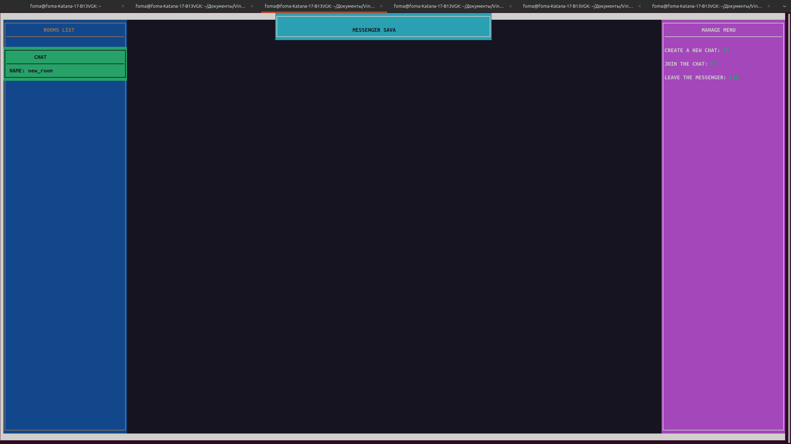
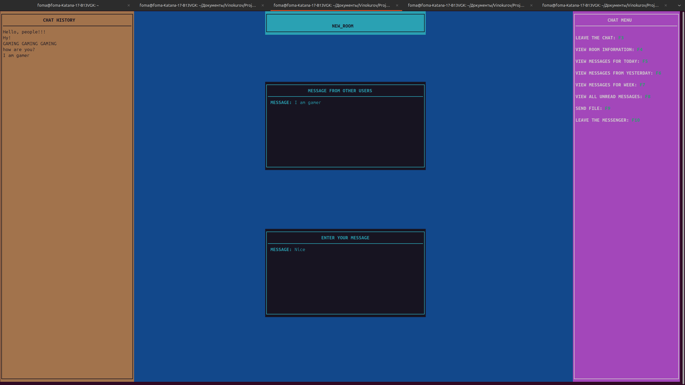
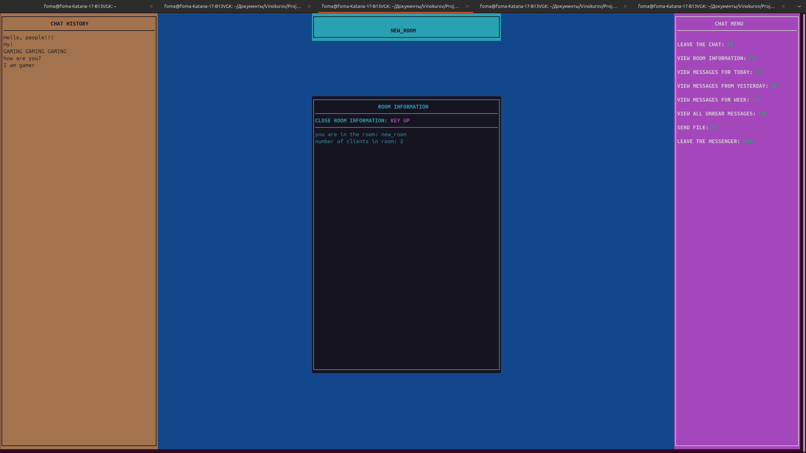
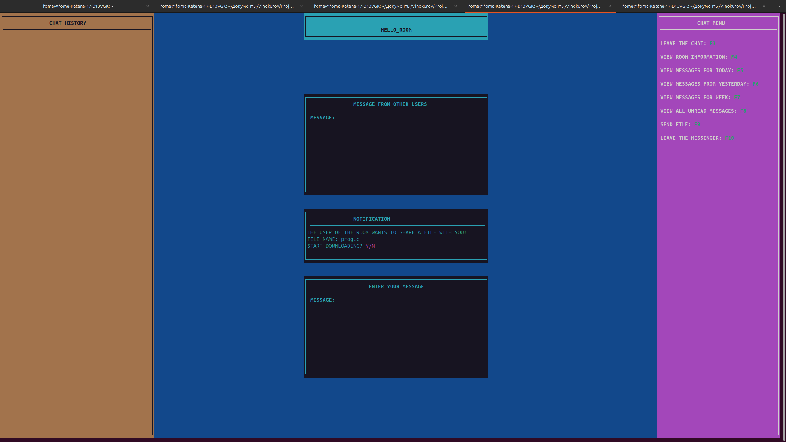
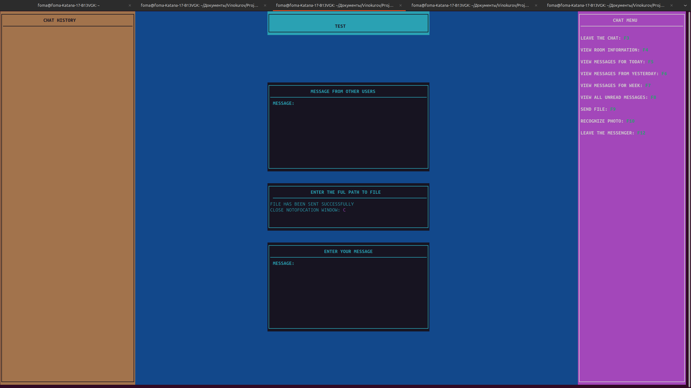

# Messenger 📱

## **Функционал на данный момент времени** 👾

Рабочая библиотека: ```libuv```

Сейчас в папке проекта находятся две рабочие подпапки: Server и Client.

```Server```: отвечает за запуск сервера, принятие сообщений от адресантов и передачу их адресатам.

```Client```: отвечает за взаимодействие клиента с сервером( чтение сообщений с экрана и от сервера ).


Также при каждом запуске создается каталог ```Database```, который содержит историю сообщений каждой комнаты в виде текстовых файлов.

Структура проекта:
```
├──📂 Server
|  ├──📂Common
|  |  ├──📂include
|  |  |  ├──📄server_functions.h        # объявления общих функций и структур
|  |  |  ├──📄logging.h                 # логгирование
|  |  ├──📂src
|  |  |  ├──📄server_functions.c        # определения общих функций
|  |  |  ├──📄logging.c                 # функции для обработки логов
|  ├──📂include
|  |  ├──📄chat_commands.h              # команды для работы с основным чатов
|  |  ├──📄file_commands.h              # команды для работы с файловым каналом
|  |  ├──📄database.h                   # история чатов
|  |  ├──📄string_function.h            # строковые функции
|  ├──📂src
|  |  ├──📄chat_commands.c
|  |  ├──📄file_commands.c
|  |  ├──📄database.c
|  |  ├──📄string_function.c
├──📂 Client
|  ├──📂Common
|  |  ├──📂include
|  |  |  ├──📄network_functions.h       # объвления общих функций, структур и перечислений
|  ├──📂include
|  |  ├──📄callbacks.h                  # колбэки для работы с основным чатом
|  |  ├──📄sending_files.h              # колбэки для работы с файловым каналом
|  |  ├──📄logger.h                     # логгировние
|  |  ├──📄user_interface.h             # функции для создания графического интерфейса консоли
|  ├──📂src
|  |  ├──📄callbacks.c
|  |  ├──📄sending_files.c
|  |  ├──📄logger.c
|  |  ├──📄user_interface.c
├──📂 ML
|  ├──📄mnist.py                        # загрузка 60.000 фотографий Mnist и запуск их обучения
|  ├──📄machine_learning.py             # обучение (обратное распространение, функции активации)
|  ├──📄file_func.py                    # сохранение весов в файл и их загрузка из файла
|  ├──📄test.py                         # проверка точности нейросети на 10.000 фотографиях Mnist
|  ├──📄bot.py                          # асинхронный бот
```

Сетевое взаимодействие происходит по схеме:
```
 ________________________________________
|                                        |
|    АДРЕСАНТ -> СЕРВЕР -> АДРЕСАТ       |
|________________________________________|

```

Команды для работы с графическим пользователем, которые поддерживает сервер

|   Команда                         |   Клавиша          |  Действие                                                                                        |
|:---------------------------------:|:------------------:|:------------------------------------------------------------------------------------------------:|
|           /join                   |   F2               |      После этой команды клиент указывает имя комнаты( чата ), к которой хочет присоединиться     |
|           /leave                  |   F3               |      Покинуть текущую комнату                                                                    |
|           /list                   |   F4               |      Отправляет клиенту имя комнаты, в которой он находится, и количество участников в комнате   |
|           /today                  |   F5               |      Показать историю сообщений в комнате за сегодняшний день                                    |
|           /yesterday              |   F6               |      Показать историю сообщений в комнате за вчерашний день                                      |
|           /week                   |   F7               |      Показать историю сообщений в комнате за последнюю неделю                                    |
|           /history                |   F8               |      Показать все непрочитанные сообщения                                                        |
|           /file                   |   F9               |      Принимает от клиента имя отправляемого файла и создает новое соединение для файловго канала |
|           /stop                   |   F10              |      Прекратить работу в мессенджере( завершить программу )                                      |


>⚠️ Если первое слово пользователя не начинается с '/', то введенный текст считается сообщением
>

## **Персистентность чатов** 📦

### Формат хранения истории сообщений

При запуске сервера в корневой папке ```Project_messenger``` создается каталог ```database```


```database``` - это список всех комнат с их историями сообщений. Например, при создании комнаты с именем ```chat```
в папке создастся файл ```chat.txt```. Каждое сообщение в файле хранится в следующем формате:

```c
seconds message [hash]
```

```
seconds - секунды с 1970 года
message - сообщение от клиента ( строка )
hash - уникально целое число, которое сопоставляется каждому сообщению в истории
```

Пример:
```c
1776593438 hello [210714636441]
1776593576 world [210732791149]
1776593600 how are you? [15227816740892963271]
...
```

### Хеширование 🔐

Правило сопоставления каждой строке уникального числа реализуется с помощью алгоритма ```DJB2```

```c
unsigned long hash( const char* string ){
    assert( string );

    unsigned long hash = 5381;
    int c;
    while( ( c = *string++ ) ){
        hash = ( (hash << 5 ) + hash ) + c;
    }
    return hash;
}
```

### Краткое пояснение некоторых функций для работы с историей сообщений 📝

```c
/*
*сохраняет сообщение клиента, которое он хотел отправить, в историю комнаты
*/
database_err_t save_message( const char* message, FILE* message_history);


/*
*Возвращаемое значение: история сообщений
*В зависимости от параметра what_message вызывается соответствующая функция

-- история за сегодня/вчера/неделю назад
-- непрочитанные сообщения
-- вся история комнаты

*После чтения перемещаемся в начало файла
*/
char* get_history( FILE* message_history, search_history_t search_history, period_type_t what_message );


/*
*Проходимся по всему файлу от начала до текущего сообщения.
*Считываем первое число каждой строки - количество секунд, в которое данное сообщение было отправлено в комнате.
*Затем находим разность между текущими секундами и секундами каждого сообщения в истории. Если разность удовлетворяет некоторому временному промежутку, то
мы добавляем сообщение в буфер hystory_info->history( буфер для хранения истории сообщений )
*/
database_err_t read_history( FILE* message_history, history_t* history_info, search_history_t search_history );


/*
*Проходимся по всему файлу от начала до текущего сообщения.
*Считываем с каждой строки хеш сообщения( почему хеш? Потому что если сообщения будут одинаковые, то просто по названию я их отличить не смогу ). Сравниваем его с хешом сообщения, который в последний раз прочитал клиент. Если они не равны - идем дальше
*Как только нашли сообщение, хеш которого равен хешу последнего прочитанного сообщения от клиента, то выходим из цикла и начинаем новый цикл
*В новом цикле записываем все сообщения после последнего прочитанного.
*/
database_err_t scan_unread_message( FILE* message_history, history_t* history_info, search_history_t search_history );

/*
*Проходимся по всему файлу от начала до текущего сообщения.
*Печатаем все сообщения из истории
*/
database_err_t read_all_messages( FILE* message_history, history_t* history_info, search_history_t search_history )
```
## **Графический клиент** 🖼️

Рабочая библиотека: ```ncurses```

### Протокол передачи файлов 📩

При нажатии клавиши ```F9``` открывается окно для ввода полного пути файла, который пользователь хочет отправить.
После ввода имени файла и пути к нему, отправитель подключается к новому каналу, предназначенному для передачи файлов.
Данный канал работает на порту 27011. Далее взаимодействие отправителя и сервера выстраивается следующим образом:

1) Сразу после подключения к файловому каналу клиент отправляет команду:
```
/store <имя файла> <размер файла>
```

2) Сервер видит, что к порту 27011 подключился отправитель, и генерирует ```transfer_id```
```
/sender_ID <transfer_id>
```
Transfer_id генерируется следующим образом: к строке ```<имя_файла>_<количество секунд в данный момент времени>```
применяется хеш функция. Результат хеш фукнции и есть transfer_id.

3) Клиент, получив transfer_id, начинает передавать содержимое файла чанками по 8КБ
```
/chunk <transfer_id> <offset> <size> <chunk>
```
>❗Если размер файла меньше 8КБ, то отправиться столько байт, сколько занимает сам файл

4) На стороне сервера есть папка ```Trasnfers```, в которую сохраняются все полученные файлы.
Имя файла генерируется следующим образом: ```<transfer_id>.<разрешение>```.
При успешном сохранении чанка отправителю посылается команда:
```
/ok <transfer_id> <new_offset>
```

5) При завершении отправки файла, отправитель отключается от файлового канала и рассылает всем участникам текущей комнаты команду:
```
/recipients_ID <transfer_id> <file_name>
```

6) При соглашении о скачивании файла со стороны пользователя, серверу отправляется команда:
```
/retrieve <transfer_id>
```

7) Сервер, получив transfer_id от получателя, находит файл в своей папке и начинает отправку чанками:
```
/chunk <transfer_id> <offset> <size> <chunk>
```

8) Клиент, получив чанк от сервера, отправляет команду об успешном сохранении данных
```
/ok <transfer_id> <new_offset>
```

9) После отправки всего содержимого файла сервер отправляет команду:
```
/close <transfer_id>
```

10) Отправитель, получив команду о завершени отправки, отключается от файлового канала.

### Краткий визуальный показ возможностей графического клиента 📟

Все функции, связанные с отрисовкой графики в коносли клиента, находятся в файле: ```Client/src/user_interface.c```

Сейчас, при запуске программы, пользователя встречает мессенджер ```SAVA``` и окно регистрации. В этом поле находиться только ip адресс.
После успешной регистрации у клиента появляется меню, пока что с двумя опциями: создать новую комнату и покинуть месседжер.
Выбор опции производится по нажатию клавиши.
При создании новой комнаты у пользователя "всплывает" окно, в котором необходимо ввести имя комнаты.
Далее слева появляется окно со всеми комнатами, в которое добавляется только что созданная.



При нажатии клавиши ```F2``` пользователь может присоединиться к вабранному чату. При присоединенни к комнате перед клиентом
появляется окно ввода сообщения, окно вывода сообщений от других пользователей. Справа находиться окно для получения истории чата, а слева меню
управления.



При желании посмотреть информацию о текущей комнате пользователь нажимает клавишу ```F4``` и перед ним всплывает окно. Окно закрывается при нажатии
клавиши верхней стрелки.



Для отправки файла необходимо нажать клавишу ```F9```. Перед клиентом появляется окно, в котором ему предлагается ввести путь к отправляемому файлу.
Далее всем участникам комнаты приходит увеломление о том, что им хотят передать файл - их право либо согласиться на скачивание, либо отказаться.



При успешном скачивании файла у пользователя появится уведомление, в котором будет оповещение и предложение зыкрыть файловое окно.


Когда файл со стороны отправителя успешно сохранился на сервер, появляется уведомление об окончании отправки.



## **ИИ - Классификатор** 🔢

Классификатор - это модель, способная по черно - белой картинке с цифрой определить, что эта за цифр.
Обучение сети осуществлялось на основе базы картионок Mnist (60.000 штук), проверка корректности обучения -
на специальных картинках для тестов (10.000 штук). На тестовом наборе нейронная сеть показала результат ```9277``` правильных ответов из
```10.000``` тысяч ```(ошибка 7%)```.


Архитектура слоев нейронной сети:

```

 ___________           ___________           __________          _________
|           |         |           |         |          |        |         |
|   INPUT   |  --->   |  LAYER_0  |  --->   | LAYER_1  | ---->  | OUTPUT  |
|___________|         |___________|         |__________|        |_________|

```

где LAYER_0 и LAYER_1 - скрытые слои

* I этап: input_data, size = 1 * 784
* II этап: weights_0, size = 784 * 400    -   первая матрица весов
* III этап: layer_0, size = 1 * 400       -   первый скрытый слой
* IV этап: weights_1, size = 400 * 100    -   вторая матрица весов
* V этап: layer_1, size = 1 * 100         -   второй скрытый слой
* VI этап: weights_2, size = 100 * 10     -   третья матрица весов
* VII этап: output, size = 1 * 10         -   10 цифр на выходе


## **Ближайшие задачи** 📌

1. Сейчас пишу бота на python. Первая цель - проверить, что пользователь отправит черно - белую картинку
с цифрой и бот даст верный результат в ответ. Затем сделать обработку цветных картинок с цифрами. Далее обработку букв.
